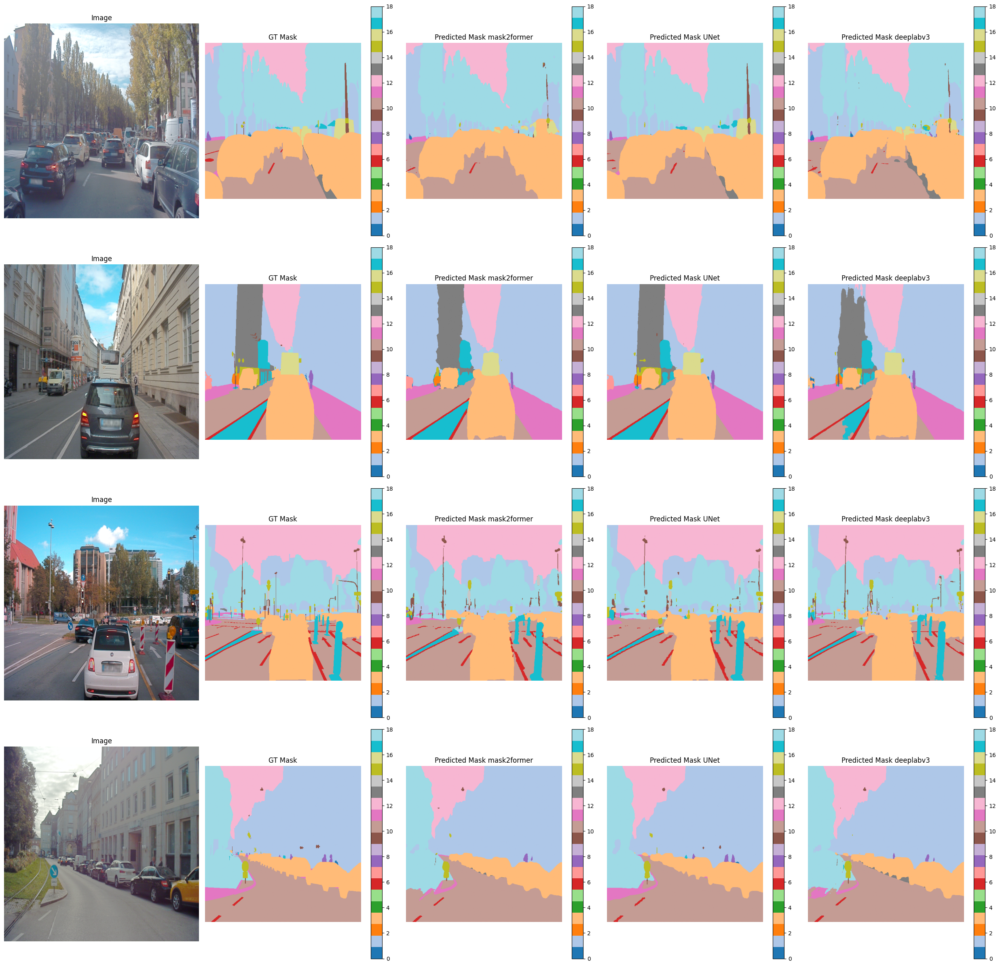

# semantic-segmentation


## 1. Введение

Семантическая сегментация — это задача компьютерного зрения, в которой каждый пиксель изображения классифицируется по принадлежности к определённому классу (например, «дорога», «автомобиль», «пешеход» или «фон»). В отличие от детекции объектов, которая определяет рамки и классы объектов, семантическая сегментация создаёт **маску сегментации**, где каждому пикселю присваивается метка класса. Это обеспечивает детальное разделение сцены на семантические области, без учёта отдельных экземпляров объектов (в отличие от инстанс-сегментации, где каждый объект получает уникальную маску).

Результат работы модели — маска того же размера, что и входное изображение, где значение каждого пикселя соответствует номеру класса (например, 0 — фон, 1 — дорога, 2 — автомобиль). Семантическая сегментация широко применяется в задачах, требующих пиксельной точности, таких как:
- **Автономное вождение**: Разметка дорог, пешеходов, автомобилей и препятствий.
- **Медицинская визуализация**: Сегментация органов или патологий на снимках МРТ или КТ.
- **Анализ спутниковых изображений**: Выделение лесов, водоёмов, зданий.

### Отличия от других задач
- **Классификация изображений**: Присваивает одну метку всему изображению, а не каждому пикселю.
- **Детекция объектов**: Определяет рамки (bounding boxes) и классы объектов, без пиксельной точности.
- **Инстанс-сегментация**: Различает отдельные экземпляры одного класса (например, каждый автомобиль получает свою маску), тогда как семантическая сегментация объединяет все объекты одного класса в одну маску.

### Формат масок
Маски сегментации — это изображения, где значение пикселя соответствует номеру класса из палитры (например, 38 классов в A2D2). Обычно маски хранятся в формате PNG с палитрой или как тензоры, где каждый канал отвечает за вероятность класса. Для обучения модели маски преобразуются в формат, где каждый пиксель имеет метку (целое число) или вероятности (после softmax).

### Простыми словами
Семантическая сегментация — это как раскрашивание изображения, где каждый участок сцены (дорога, небо, машина) получает свой цвет, соответствующий классу. Это помогает машинам «понимать» сцену на уровне пикселей, что критично для автономного вождения или других сложных задач.

## 2. Датасет

Модели, рассмотренные в этом проекте, обучались и тестировались на датасете **Audi Autonomous Driving Dataset (A2D2)**, выпущенном Audi в 2020 году. A2D2 — открытый датасет, созданный для исследований в области автономного вождения, компьютерного зрения и робототехники. Он включает данные с нескольких сенсоров:
- **Камеры**: Шесть RGB-камер высокого разрешения (1920x1208) с 360-градусным покрытием.
- **LiDAR**: 3D-облака точек для точного описания пространства.
- **Аннотации**: Маски для семантической сегментации (пиксельные метки для 38 классов, таких как «дорога», «здание», «автомобиль»), а также 2D- и 3D-ограничивающие рамки.

Официальный сайт: [www.a2d2.audi](http://www.a2d2.audi).

### Предобработка данных
Маски сегментации в A2D2, хранящиеся в формате PNG, имеют высокое разрешение (1920x1208) и содержат 38 классов, что делает их обработку ресурсоёмкой. Для ускорения обучения и тестирования была проведена предобработка:
- **Сжатие изображений**: Маски и изображения уменьшены (до 512x512) для снижения вычислительной нагрузки.
- **Сокращение классов**: Из 38 классов выбраны только ключевые (например, «дорога», «автомобиль», «пешеход», «фон»), а редкие классы объединены в «фон» или исключены.
- **Формат**: Маски преобразованы в numpy массивы с целочисленными метками (например, 0 для фона, 1 для дороги) или в one-hot представление для обучения. Для них сформирован отдельный датасет preprocessed_masks

В проекте использовались данные только с фронтальной камеры (`cam_front_center`), с акцентом на семантические маски из папки `label/cam_front_center`.

### Структура датасета
Датасет организован следующим образом (с акцентом на маски сегментации):

```
Dataset a2d2 = camera_lidar_semantic_bboxes/
├── camera/
│   ├── special/
│   │   ├── scene_num/
│   │   │   ├── camera/
│   │   │   │   ├── cam_front_center/
│   │   │   │   │   ├── scene_num_camera_frontcenter_identify.png
│   │   │   ├── label/
│   │   │   │   ├── cam_front_center/
│   │   │   │   │   ├── scene_num_label_frontcenter_identify.png  # Семантическая маска
│   ├── train/
│   │   ├── scene_num/
│   │   │   ├── camera/
│   │   │   │   ├── cam_front_center/
│   │   │   │   │   ├── scene_num_camera_frontcenter_identify.png
│   │   │   ├── label/
│   │   │   │   ├── cam_front_center/
│   │   │   │   │   ├── scene_num_label_frontcenter_identify.png  # Семантическая маска
│   ├── test/
│   │   ├── scene_num/
│   │   │   ├── camera/
│   │   │   │   ├── cam_front_center/
│   │   │   │   │   ├── scene_num_camera_frontcenter_identify.png
│   │   │   ├── label/
│   │   │   │   ├── cam_front_center/
│   │   │   │   │   ├── scene_num_label_frontcenter_identify.png  # Семантическая маска
│   ├── LICENSE
│   ├── class_list.json

preprocessed_masks/
├── train/
│   ├── mask_num_mask.npy
├── test/
│   ├── mask_num_mask.npy
├── train_list.json
├── test_list.json
```

## 3. Модели

В проекте реализованы три модели семантической сегментации: **UNet** с бэкбоном ResNet-50, **DeepLabV3** с бэкбоном ResNet-50 и **Mask2Former**, адаптированная для семантической сегментации. Каждая модель подходит для разных сценариев благодаря своим архитектурным особенностям.

## 4. UNet (на основе ResNet-50)

UNet — это классическая архитектура для семантической сегментации, представленная в 2015 году. Её название отражает U-образную структуру: энкодер сжимает изображение, а декодер восстанавливает маску. Пропуски (skip connections) между энкодером и декодером сохраняют детали. В этой реализации используется ResNet-50 как бэкбон.


### Ключевые компоненты
#### Энкодер (Backbone)
- **ResNet-50**: Предобученная на ImageNet свёрточная сеть с 50 слоями и остаточными соединениями (residual blocks). Извлекает карты признаков, уменьшая разрешение через свёртки и пулинг (stride=2).
- **Признаки**: От низкоуровневых (края, текстуры) на ранних слоях до высокоуровневых (формы, объекты) на поздних.
- **Выход**: Карты признаков разного разрешения (например, 1/4, 1/8, 1/16, 1/32 от исходного размера).

#### Декодер
- Восстанавливает разрешение через upsampling (например, билинейная интерполяция или транспонированные свёртки).
- Объединяет признаки из энкодера через skip connections для сохранения деталей, утерянных при сжатии.

#### Пропуски (Skip Connections)
- Конкатенация признаков из энкодера (того же масштаба) с признаками декодера.
- Улучшает точность границ объектов, что важно для A2D2 (например, разделение дороги и тротуара).

#### Выход
- Финальная свёртка (1x1) с softmax выдаёт маску размером \( [C, H, W] \), где \( C \) — число классов, а значения — вероятности классов для каждого пикселя.

**Простыми словами**: UNet — это как сжатие изображения в компактные признаки, а затем их восстановление в маску с сохранением мелких деталей благодаря пропускам.

## 5. DeepLabV3 (на основе ResNet-50)

DeepLabV3 — это свёрточная модель, представленная в 2017 году, которая использует атруозные свёртки (dilated convolutions) для захвата большего контекста без потери разрешения. Она эффективна для сложных сцен, таких как A2D2, благодаря модулю Atrous Spatial Pyramid Pooling (ASPP).


### Ключевые компоненты
#### Бэкбон
- **ResNet-50**: Как и в UNet, извлекает карты признаков, но последние слои используют атруозные свёртки (dilation rate >1), чтобы увеличить рецептивное поле без уменьшения разрешения.
- **Выход**: Карта признаков с высоким разрешением (например, 1/8 от исходного размера).

#### Atrous Spatial Pyramid Pooling (ASPP)
- Применяет атруозные свёртки с разными dilation rates (например, 1, 6, 12, 18) параллельно, чтобы захватывать признаки на разных масштабах.
- Включает глобальный пулинг (image-level context) для учёта всей сцены.
- Объединяет результаты в единую карту признаков.

#### Декодер (DeepLabV3+)
- Комбинирует признаки из ASPP с низкоуровневыми признаками бэкбона (например, из layer1 ResNet-50).
- Применяет upsampling и свёртки для уточнения границ масок.

#### Выход
- Финальная свёртка с softmax выдаёт маску \( [C, H, W] \).

**Простыми словами**: DeepLabV3 «видит» сцену на разных масштабах, что помогает точно выделять объекты разного размера (например, машины и мелких пешеходов).

## 6. Mask2Former (адаптированная для семантической сегментации)

Mask2Former — это трансформерная модель, изначально разработанная для инстанс-сегментации, но адаптированная в этом проекте для семантической сегментации. Представленная в 2022 году, она использует запросы (queries) для предсказания масок классов, обеспечивая высокую точность благодаря трансформерному подходу.


### Ключевые компоненты
#### Бэкбон
- **ResNet-50**: Предобученная CNN, извлекающая карты признаков из слоёв `conv1`, `layer1`, `layer2`, `layer3`, `layer4` с каналами 64, 256, 512, 1024, 2048 соответственно.
- **Выход**: Карты признаков разного разрешения (например, 1/4, 1/8, 1/16, 1/32 от входного изображения).

#### Пиксельный декодер
- Принимает карты признаков из бэкбона (`layer1`–`layer4`).
- **Lateral Convolutions**: Сжимает каналы каждой карты до `hidden_dim=128` с помощью 1x1 свёрток.
- **Top-down путь**: Начинает с самой глубокой карты (`layer4`), увеличивает её (bilinear upsampling), добавляет к следующей карте (`layer3`), применяет 3x3 свёртку и ReLU. Процесс повторяется до `layer1`.
- **Выход**: Карта признаков размером \( [128, H/4, W/4] \), затем увеличенная до \( [128, H, W] \).

#### Трансформер-декодер
- **Запросы**: 75 обучаемых векторов размером 128 (`num_queries=75`), инициализированных через `nn.Embedding`.
- **Слои**: 4 слоя декодера (`num_layers=4`), каждый с:
  - **Self-Attention**: Между запросами (с 4 головами, `num_heads=4`), чтобы избежать дублирования.
  - **Cross-Attention**: Между запросами и пиксельными признаками (преобразованными в \( [($H/4 \times W/4$), 128] \)).
  - **Feed-Forward Network (FFN)**: Линейный слой \( 128 → 512 \), ReLU, \( 512 → 128 \).
  - **Нормализация**: LayerNorm после каждого этапа.
- **Выход**: \( [75, 128] \), где каждый запрос представляет потенциальный сегмент, где 75 - число запросов, 128 - размер вектора запроса.

#### Масочный эмбеддинг
- **MLP**: Трёхслойная сеть (128 → 128 → 128, с ReLU) преобразует запросы в эмбеддинги масок.
- **Маски**: Вычисляются через скалярное произведение эмбеддингов запросов \( [75, 128] \) и пиксельных признаков \( [128, H, W] \), давая маски \( [75, H, W] \).

#### Линейная проекция
- Линейный слой преобразует маски \( [H, W, 75] \) в вероятности классов \( [H, W, num_classes] \).
- Финальный выход: \( [num_classes, H, W] \), где softmax даёт вероятности классов на пиксель.

#### Потери
- При обучении: Cross-entropy между предсказанными масками и ground-truth, с весами классов (`class_weights`) и игнорированием фона (метка 255).
- При инференсе: Softmax выдаёт вероятности классов.

**Простыми словами**: Mask2Former использует трансформер, чтобы «спросить» у изображения, какие области относятся к классам, и выдаёт маску, где каждый пиксель классифицирован.

## 7. Метрики сегментации

Метрики оценивают точность классификации пикселей.

### Mean Intersection over Union (mIoU)
mIoU — средняя IoU по классам:

$$
\text{IoU}_c = \frac{\text{TP}_c}{\text{TP}_c + \text{FP}_c + \text{FN}_c}, \quad 
\text{mIoU} = \frac{1}{C} \sum_{c=1}^C \text{IoU}_c
$$

- $\text{TP}_c$: пиксели, правильно классифицированные как класс $c$.  
- $\text{FP}_c$: пиксели, ошибочно классифицированные как класс $c$.  
- $\text{FN}_c$: пиксели класса $c$, ошибочно классифицированные как другой класс.  

### Dice Score (F1 для сегментации)
$$
\text{Dice}_c = 2 \cdot \frac{\text{TP}_c}{2 \cdot \text{TP}_c + \text{FP}_c + \text{FN}_c}
$$

- Средний Dice по классам оценивает баланс между точностью и полнотой.

### Pixel Accuracy
Доля правильно классифицированных пикселей:

$$
\text{Accuracy} = \frac{\sum_c \text{TP}_c}{\text{Все пиксели}}
$$

### Mean Pixel Accuracy
Средняя точность по классам:

$$
\text{Mean Pixel Accuracy} = \frac{1}{C} \sum_{c=1}^C \frac{\text{TP}_c}{\text{TP}_c + \text{FN}_c}
$$


## 8. Результаты

В рамках проекта реализованы и протестированы три модели семантической сегментации на датасете A2D2 (фронтальная камера): **UNet (ResNet-50)**, **DeepLabV3 (ResNet-50)** и **Mask2Former**. Модели оценивались по метрикам **mIoU**, **Dice Score**, **Pixel Accuracy** и **Mean Pixel Accuracy** на предобработанных масках с сокращённым набором классов.

На изображении ниже показаны примеры предсказанных масок для всех моделей на одном кадре из датасета A2D2:



### Количественные результаты
Таблица ниже суммирует результаты на тестовом наборе A2D2:

| Модель             | mIoU  | Dice Score | Pixel Accuracy | Mean Pixel Accuracy |
|--------------------|-------|------------|----------------|---------------------|
| UNet (ResNet-50)   | 0.384 | 0.437      | 0.940          | 0.432              |
| DeepLabV3 (ResNet-50) | 0.395 | 0.449   | 0.953          | 0.445              |
| Mask2Former        | 0.387 | 0.441      | 0.949          | 0.436              |

**Наблюдения**:
- **DeepLabV3** показала наивысший mIoU (0.395), Dice Score (0.449) и Pixel Accuracy (0.953), благодаря модулю ASPP, который эффективно захватывает контекст сцены и обрабатывает объекты разного масштаба.
- **Mask2Former** имеет близкие результаты (mIoU 0.387, Dice 0.441), что демонстрирует потенциал трансформерного подхода, но её производительность чуть ниже, возможно, из-за необходимости более длительного обучения или настройки гиперпараметров (например, `num_queries=75`).
- **UNet** показала самый низкий mIoU (0.384) и Pixel Accuracy (0.940), но остаётся конкурентоспособной благодаря простоте и эффективности skip connections для чётких границ.
- Все модели имеют высокую Pixel Accuracy (>0.94), что указывает на хорошую общую классификацию, но mIoU и Dice ниже, вероятно, из-за несбалансированности классов в A2D2 или сложных мелких объектов (например, пешеходов).

- **DeepLabV3**: Точные маски для крупных объектов (дороги, здания), с хорошей детализацией границ.
- **Mask2Former**: Хорошо справляется с контекстом, но иногда теряет мелкие объекты из-за ограниченного числа запросов.
- **UNet**: Чёткие границы благодаря skip connections, но менее точна в сложных сценах с перекрытиями.

### Анализ
- **DeepLabV3** — лучший выбор для A2D2 благодаря высокому mIoU и способности обрабатывать объекты разного размера, что важно для сцен автономного вождения.
- **Mask2Former** предлагает современный трансформерный подход, но требует тщательной настройки (например, увеличение `num_queries` или числа слоёв) для улучшения результатов.
- **UNet** проста и быстра в обучении, подходит для задач с ограниченными ресурсами, но уступает в сложных сценах.
- **Рекомендации**: Предобработка масок (сокращение классов, сжатие) критически важна для скорости и точности. Для повышения mIoU можно сбалансировать классы (например, с помощью `class_weights` в Mask2Former) или использовать аугментацию данных.
